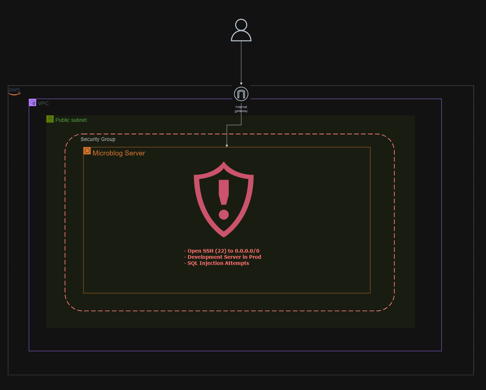
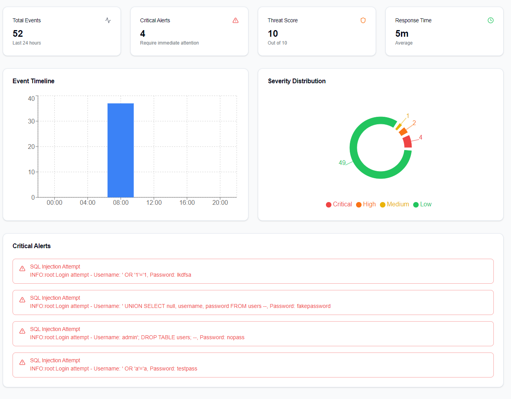
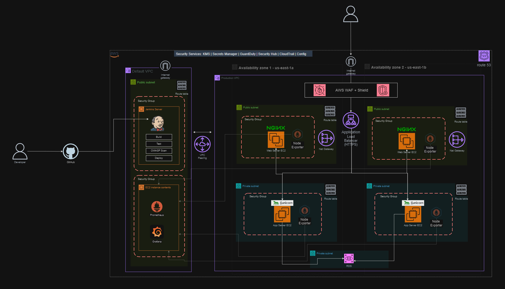

# Microblog Infrastructure Security Audit Report

## Executive Summary
As requested, our team assessed Microblog's infrastructure. We conducted a comprehensive security audit of the cloud infrastructure following reports of suspicious system behavior and unusual user activity. Our investigation revealed several critical vulnerabilities that require immediate attention to prevent potential data breaches and ensure the platform's security as the company continues its rapid growth.

### Key Findings
1. Critical vulnerabilities were identified in three main areas:
   - Production environment running on insecure development server
   - Overly permissive security group configurations
   - SQL injection vulnerabilities in user authentication
   
2. Recent suspicious activities traced to:
   - Multiple failed login attempts with SQL injection patterns shown in log, `all_logins_10_24_2024.log`
   - Unauthorized access attempts from various global IP addresses
   - Unusual system behavior due to development server limitations

3. Primary Recommendations:
   - Immediate migration to production-grade server infrastructure
   - Implementation of strict security group policies
   - Remediation of SQL injection vulnerabilities
   - Deployment of AWS security services suite (KMS, GuardDuty, Security Hub, etc.)

<hr />



## Dashboard View - Security Event Alerts



---

## Three Immediate Vulnerabilities

### 1. Development Server in Production Environment
- **Severity**: Critical
- **Issue**: The application currently runs on Flask's development server in production.
- **Evidence**: Current implementation in `blog.sh`:
```bash
# Current Vulnerable Implementation
flask run --host=0.0.0.0 > flask.log 2>&1 &
```
- **Solution**: Replace with Gunicorn and systemd:
```bash
# Production-Grade Fix
sudo tee /etc/systemd/system/microblog.service << EOF
[Unit]
Description=Microblog Gunicorn Service
After=network.target

[Service]
User=ubuntu
WorkingDirectory=/home/ubuntu/microblog
Environment="PATH=/home/ubuntu/microblog/venv/bin"
ExecStart=/home/ubuntu/microblog/venv/bin/gunicorn -w 4 -b 0.0.0.0:5000 microblog:app
Restart=always

[Install]
WantedBy=multi-user.target
EOF
```

### 2. Overly Permissive Security Groups
- **Severity**: Critical
- **Issue**: Unrestricted access to critical ports from any IP address
- **Evidence**: Current security group configuration:
```hcl
# Current Vulnerable Configuration
ingress {
    from_port   = 22
    to_port     = 22
    protocol    = "tcp"
    cidr_blocks = ["0.0.0.0/0"]
}
```
- **Solution**: Implement restricted security group rules:
```hcl
# Security-Hardened Configuration
ingress {
    from_port   = 22
    to_port     = 22
    protocol    = "tcp"
    cidr_blocks = ["your_trusted_ip_range/32"]
}

ingress {
    from_port   = 443
    to_port     = 443
    protocol    = "tcp"
    cidr_blocks = ["0.0.0.0/0"]
}
```

### 3. SQL Injection Vulnerabilities
- **Severity**: Critical
- **Issue**: Unsanitized user input in database queries
- **Evidence**: Detected attack attempts in logs:
```log
Login attempt - Username: ' OR '1'='1, Password: ****
Login attempt - Username: admin'; DROP TABLE users; --, Password: ****
```
- **Solution**: Implement parameterized queries:
```python
# Secure Implementation
from sqlalchemy import text
result = db.session.execute(
    text("SELECT * FROM users WHERE username = :username"),
    {"username": username}
)
```

## Additional Findings

1. No HTTPS in production exposes all traffic in plaintext.
2. Passwords stored without proper hashing could lead to credential exposure.
3. Missing rate limiting allows unlimited login attempts.
4. No logging of successful logins makes audit trails incomplete.
5. Unpatched dependencies could contain known vulnerabilities.
6. Missing WAF leaves application exposed to common web attacks.
7. No backup strategy risks permanent data loss.
8. Plain text configuration files may expose sensitive credentials.
9. Missing monitoring prevents early detection of security incidents.
10. Lack of session timeouts allows indefinite access after login.


## Compliance Considerations
- Use frameworks such as the NIST to adhere to CIA triad
- Implements controls for PCI DSS compliance
- Addresses GDPR requirements for data protection
- Aligns with SOC 2 security principles

# Secure Deployment Exemplar

The infrastructure diagram below illustrates an ideal secure architecture that would address the current vulnerabilities in the Microblog application. 

By implementing a multi-AZ setup with proper VPC segmentation, WAF protection, and dedicated security groups across public and private subnets, it offers significant improvements over the current single-instance deployment. The addition of AWS Shield and WAF would prevent SQL injection attempts, while the separation of components into private subnets with controlled access through NGINX reverse proxies would eliminate the current security group exposure. 

This architecture also incorporates proper CI/CD pipelines through Jenkins, replacing the direct Flask development server deployment with a production-grade setup, and introduces monitoring through Node Exporter - addressing all three major vulnerabilities while providing a scalable, secure foundation for future growth.




## Conclusion
The identified vulnerabilities pose significant risks to Microblog's infrastructure and user data. By implementing the recommended fixes for the three critical vulnerabilities and following the proposed timeline for additional security measures, Microblog can significantly improve its security posture and protect against potential threats as it continues to scale.

### Prospective Success Metrics
- Zero critical security incidents
- 99.9% uptime
- Compliance with all relevant standards
- Reduced mean time to detect (MTTD) and respond (MTTR)

### Team Members
- **[Kevin Gonzalez](https://github.com/kevingonzalez7997)**
- **[Shafee Ahmed](https://github.com/shafeeshafee)**
- **[Clinton Kanyali](https://github.com/clintkan)**
- **[Uzo Bolarinwa](https://github.com/uzobola)**

