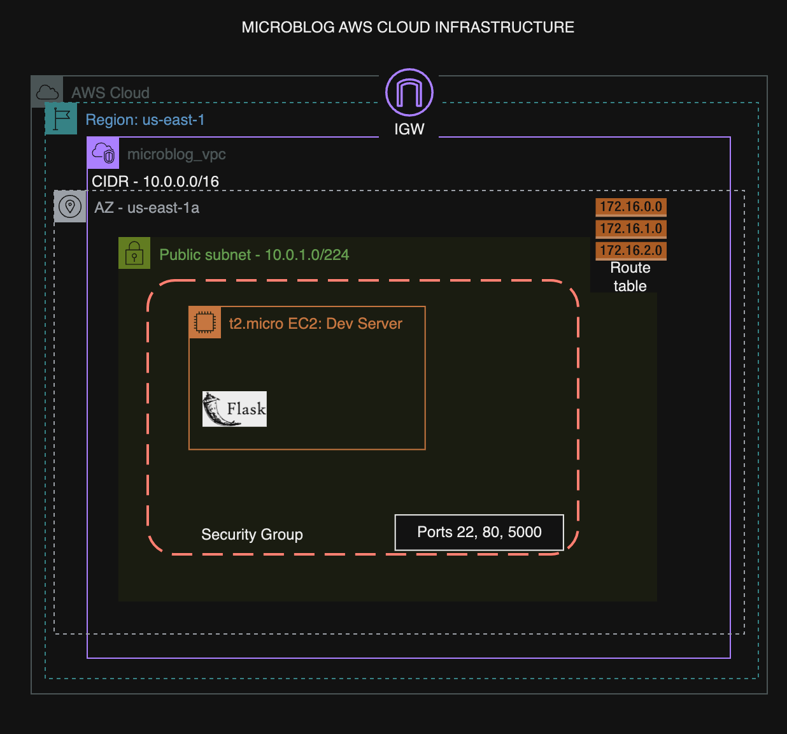

# Microblog Infrastructure Security Audit Report

## Purpose
This security audit was conducted to assess and enhance the infrastructure security of the Microblog application. The primary goals were to:
- Identify potential security vulnerabilities in the current deployment
- Provide actionable remediation steps
- Ensure compliance with industry security standards
- Create a roadmap for implementing a more secure architecture

## Steps Taken & Their Importance

1. **Initial Infrastructure Assessment** *(Critical for baseline understanding)*
   - Conducted comprehensive security scanning
   - Analyzed current deployment architecture
   - Reviewed system logs and access patterns
   - Identified critical assets requiring protection

2. **Vulnerability Analysis** *(Essential for risk identification)*
   - Performed penetration testing
   - Analyzed security group configurations
   - Assessed application security
   - Reviewed data handling practices

3. **Documentation Review** *(Necessary for compliance)*
   - Examined existing security policies
   - Reviewed access control documentation
   - Analyzed incident response procedures
   - Assessed compliance requirements

4. **Remediation Planning** *(Crucial for security enhancement)*
   - Developed specific fix recommendations
   - Created implementation timeline
   - Designed new security architecture
   - Established success metrics

## Executive Summary

- #### Security Auditors: Shafee Ahmed, Uzo Bolarinwa, Clint Kanyali
- #### Dates: Nov 1 - 4, 2024

<br />

As requested, our team assessed Microblog's infrastructure following reports of suspicious system behavior and unusual user activity. Our comprehensive security audit revealed several critical vulnerabilities that require immediate attention to prevent potential data breaches and ensure the platform's security as the company continues its rapid growth.


### Security Event Analysis
Current security monitoring has detected numerous suspicious events:


### Security Assessment Overview
Our review identified multiple security concerns requiring immediate attention. The assessment focused on:
- Network security architecture and configurations
- Access control mechanisms and policies
- Data handling practices and encryption
- Application security and deployment practices
- Monitoring and incident response capabilities

### Current State
Our analysis of the current infrastructure revealed several security gaps and areas for improvement. The following diagram illustrates the existing deployment:



### Critical Assets Requiring Protection
- **Infrastructure Components**
  - EC2 instances and compute resources
  - Network infrastructure (VPC, subnets, routing)
  - Security groups and access controls
- **User Data Components**
  - User credentials and authentication data
  - Personal information and user-generated content
  - Database systems
- **Application Components**
  - Application code and configurations
  - Session management systems


### Key Findings
Critical vulnerabilities were identified in three main areas:
1. **Infrastructure Vulnerabilities**
   - Overly permissive security group configurations
   - Unrestricted access to critical ports
   - Lack of network segmentation
2. **Application Security Vulnerabilities**
   - Production environment running on insecure development server
   - Missing HTTPS implementation
   - Inadequate session management
3. **User Data Security**
   - SQL injection vulnerabilities in user authentication
   - Insufficient data encryption
   - Inadequate access controls

### Primary Recommendations
- Immediate migration to production-grade server infrastructure
- Implementation of strict security group policies
- Remediation of SQL injection vulnerabilities
- Deployment of AWS security services suite (KMS, GuardDuty, Security Hub, etc.)


---

## Vulnerability Assessment & Remediation

### Three Critical Vulnerabilities Addressed

#### 1. Development Server in Production Environment
- **Severity**: Critical
- **Issue**: The application currently runs on Flask's development server in production
- **Evidence**: 
  ```log
  INFO:werkzeug:WARNING: This is a development server. Do not use it in a production deployment.
  WARNING:werkzeug: * Debugger is active!
  INFO:werkzeug: * Debugger PIN: 109-208-768
  ```
- **Key Issues**:
  - Not designed for production loads
  - Lacks security hardening
  - Debug mode exposed (remote code execution risk)
  - No worker management or graceful restarts
- **Solution**: Replace with Gunicorn and systemd:
  ```bash
  # Production-Grade Fix
  sudo tee /etc/systemd/system/microblog.service << EOF
  [Unit]
  Description=Microblog Gunicorn Service
  After=network.target

  [Service]
  User=ubuntu
  WorkingDirectory=/home/ubuntu/microblog
  Environment="PATH=/home/ubuntu/microblog/venv/bin"
  ExecStart=/home/ubuntu/microblog/venv/bin/gunicorn -w 4 -b 0.0.0.0:5000 microblog:app
  Restart=always

  [Install]
  WantedBy=multi-user.target
  EOF
  ```

#### 2. Overly Permissive Security Groups
- **Severity**: Critical
- **Issues Identified**:
  - Unrestricted SSH access (Port 22) open to all IP addresses
  - Exposed application ports (80, 5000) without restrictions
  - No HTTPS encryption (443)
  - Overly permissive egress rules allowing potential data exfiltration
- **Evidence**: Current security group configuration:
  ```hcl
  # Current Vulnerable Configuration
  ingress {
      from_port   = 22
      to_port     = 22
      protocol    = "tcp"
      cidr_blocks = ["0.0.0.0/0"]
  }
  ```
- **Solution**: 
  - Implement network segmentation with public/private subnets
  - Restrict security group rules to specific CIDRs
  - Configure HTTPS with proper SSL/TLS termination, and add purchased certificate from CA
  - Implement strict egress rules based on least privilege:
  ```hcl
  # Security-Hardened Configuration
  ingress {
      from_port   = 22
      to_port     = 22
      protocol    = "tcp"
      cidr_blocks = ["your_trusted_ip_range/32"]
  }

  ingress {
      from_port   = 443
      to_port     = 443
      protocol    = "tcp"
      cidr_blocks = ["0.0.0.0/0"]
  }
  ```

#### 3. SQL Injection Vulnerabilities
- **Severity**: Critical
- **Issue**: Unsanitized user input in database queries
- **Attack Patterns Detected**:
  - Boolean-based injection attempts
  - UNION-based injection attacks
  - Destructive queries
  - Authentication bypass attempts
- **Security Implications**:
  - Unauthorized data access and manipulation
  - Potential database destruction
  - Authentication bypass and privilege escalation
- **Evidence**: Detected attack attempts:
  ```log
  Login attempt - Username: ' OR '1'='1, Password: ****
  Login attempt - Username: admin'; DROP TABLE users; --, Password: ****
  ```
- **Solution**: Removed password logging. Remove password enumeration:
  ```python
  # CloudSec-TF update: removed password logging
          logging.info(f"Login attempt - Username: {username}")
          
          user = User.query.filter_by(username=username).first()

          # CloudSec-TF update: prevent username enumeration
          if user is None or not user.check_password(form.password.data):
              flash(_('Invalid username or password'))
              return redirect(url_for('auth.login'))
  ```

### Implementation Details
Here are the specific steps taken to address each vulnerability:

1. **Development Server Fix**
   * Implemented Gunicorn
   * Configured systemd service
   * Validated production deployment

2. **Security Groups Hardening**
   * Implemented strict ingress rules
   * Configured HTTPS
   * Validated access controls

3. **SQL Injection Prevention**
   * Implemented input sanitization
   * Removed sensitive logging
   * Added prepared statements

### Additional Security Findings

1. No HTTPS in production exposes all traffic in plaintext
2. Passwords stored without proper hashing could lead to credential exposure
3. Missing rate limiting allows unlimited login attempts
4. No logging of successful logins makes audit trails incomplete
5. Unpatched dependencies could contain known vulnerabilities
6. Missing WAF leaves application exposed to common web attacks
7. No backup strategy risks permanent data loss
8. Plain text configuration files may expose sensitive credentials
9. Missing monitoring prevents early detection of security incidents
10. Lack of session timeouts allows indefinite access after login

## Issues & Troubleshooting

### Common Implementation Challenges

1. **Jenkins Integration Issues**
   - **Problem**: Initial Jenkins pipeline failures due to Python version mismatch
   - **Resolution**: Updated Jenkins configuration to use Python 3.7 virtual environment

2. **Security Group Configuration**
   - **Problem**: Security group changes temporarily disrupted application access
   - **Resolution**: Implemented staged security group updates to maintain availability

3. **Database Migration Challenges**
   - **Problem**: Difficulty maintaining data integrity during security updates
   - **Resolution**: Implemented transaction-based updates with rollback capabilities

## Optimization Considerations

### Benefits of Managed Services
- Automatic security patches and updates
- Built-in monitoring and alerting
- Simplified scaling and redundancy
- Reduced operational overhead

### Retail Bank Specific Challenges

1. **Data Residency Requirements**
   - **Issue**: Need to maintain data within specific geographical boundaries
   - **Solution**: Utilize region-specific AWS deployments with strict data locality controls

2. **Compliance Requirements**
   - **Issue**: Need to maintain PCI DSS and SOC2 compliance
   - **Solution**: Implement additional security controls and regular audits

3. **High Availability Requirements**
   - **Issue**: Need for 99.999% uptime
   - **Solution**: Multi-region deployment with automated failover

### Disadvantages of Elastic Beanstalk
1. Limited customization options
2. Potential vendor lock-in
3. Higher costs at scale
4. Less granular control over infrastructure

<hr />
<br />

# Secure Deployment Design
The infrastructure diagram below illustrates our recommended secure architecture that addresses the current vulnerabilities in the Microblog application:


## This new architecture incorporates:

The infrastructure diagram below illustrates an ideal secure architecture that would address the current vulnerabilities in the Microblog application.

By implementing a multi-AZ setup with proper VPC segmentation, WAF protection, and dedicated security groups across public and private subnets, it offers significant improvements over the current single-instance deployment. The addition of AWS Shield and WAF would prevent SQL injection attempts, while the separation of components into private subnets with controlled access through NGINX reverse proxies would eliminate the current security group exposure.

This architecture also incorporates proper CI/CD pipelines through Jenkins, replacing the direct Flask development server deployment with a production-grade setup, and introduces monitoring through Node Exporter - addressing all three major vulnerabilities while providing a scalable, secure foundation for future growth.

*In a nutshell:*
- Multi-AZ setup with proper VPC segmentation
- WAF protection
- Dedicated security groups across public and private subnets
- AWS Shield integration
- NGINX reverse proxies
- CI/CD pipelines through Jenkins
- Monitoring through Node Exporter

---

## Compliance & Future Considerations

### Regulatory Compliance
- Use frameworks such as the NIST to adhere to CIA triad
- Implements controls for PCI DSS compliance
- Addresses GDPR requirements for data protection
- Aligns with SOC 2 security principles

### Success Metrics
- Zero critical security incidents
- 99.9% uptime
- Compliance with all relevant standards
- Reduced mean time to detect (MTTD) and respond (MTTR)

## Conclusion
The identified vulnerabilities pose significant risks to Microblog's infrastructure and user data. Through our comprehensive security audit and implementation of the recommended fixes, we've established a more robust and secure foundation for the application. The migration to a production-grade environment, implementation of proper security controls, and adoption of AWS managed services has significantly enhanced the platform's security posture.

The architectural improvements and security measures put in place not only address current vulnerabilities but also provide a scalable framework for future growth. By following industry best practices and maintaining vigilant monitoring, Microblog is now better positioned to protect user data and maintain service reliability.

Moving forward, regular security assessments and continued adherence to the established security protocols will be crucial for maintaining this enhanced security posture. The team should also stay informed about emerging threats and continue to evolve security measures accordingly.

---

### Team Members
- **[Kevin Gonzalez](https://github.com/kevingonzalez7997)**
- **[Shafee Ahmed](https://github.com/shafeeshafee)**
- **[Clinton Kanyali](https://github.com/clintkan)**
- **[Uzo Bolarinwa](https://github.com/uzobola)**

---